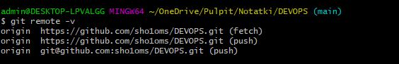
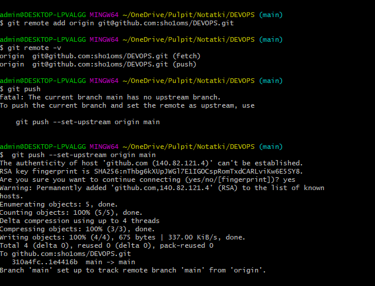
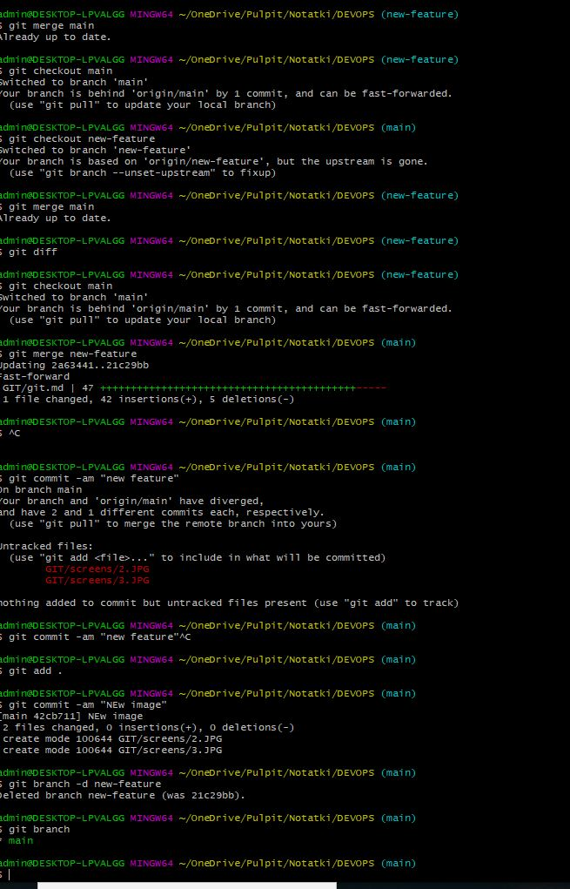

## Configuration ssh keys git
Link:
https://docs.github.com/en/free-pro-team@latest/github/authenticating-to-github/generating-a-new-ssh-key-and-adding-it-to-the-ssh-agent


1. ssh-keygen -t rsa -b 4096 -C "piotrsobczak.wro@gmail.com
2. cat  ~/.ssh/id_rsa.pub
3. ssh-add ~/.ssh/id_rsa
4. eval $(ssh-agent -s)

Unable to git clone via ssh method.
1. Remove origin:
<p align="left">
  
  <p align="left">
  
</p>

Problem SOLVED:
<p align="left">
  
</p>


## BASIC commands

```
# New branch on origin
git push --set-upstream origin new-feature

```


## GIT scenario

### syncro main with feture branch


<p align="left">
  
</p>

Check if git is pushed to origin master after merge.

if there will be problem

```
git push -f 
```
### List existing remotes
```
$ git remote -v
origin  https://github.com/sho1oms/DEVOPS.git (fetch)
origin  https://github.com/sho1oms/DEVOPS.git (push)
```
### Use HTTPS

```
$ git remote set-url https://link/repo.git
```
### Use SSH

```
git remote set-url git@link/repo.git
```

## Branch management

### Force push to remote repo

git push -f
gut push --force

Not recommeneded way to follow.

### Identity merged branches

* list branches that have been merge into  branch
* Usefull for knowing that feature have been incorporated
* Usefull for cleanup after merging many features

$ git branch --merged

$ git branch --no-merged

### Delete local and remote branch

Delete branch LOCAL
```
# Delete branch - LOCAL
git branch -d new-feature

# Delete no merged branch - LOCAL
git branch -d new-feature
```

Delete branch - REMOTE

```
# Delete remote branch v1.7.0+
git push --delete origin new-feature

# Delete remote branch v2.8.0+
git push -d origin new-feature
```

### Prune stale branches


## Create tags

* Tags allow marking points in history as important
* A named reference to a commit
* most often used to mark releases v1.0.0 etc

```
# Add lightweight tag
git tag issue136 <commit id>

# Add annotated tag (most common)

git tag -a v1.1 -m "Version 1.0" <commit id>

# List tag

git tag

git tag --list
git tag -l

# List tags beggining with "v2"
git tag -l "v2*"

# List tags with annotations

git show v1.1
git diff v1.1 v1.2

# Delete tags

git tag --delete v1.2
git tag -d v1.2

# Push tags to remote
git push origin
git push --tags

# Checkout branch tags 
git checkut -b new_branch v1.1
git checkout v1.1

```


sss
sss